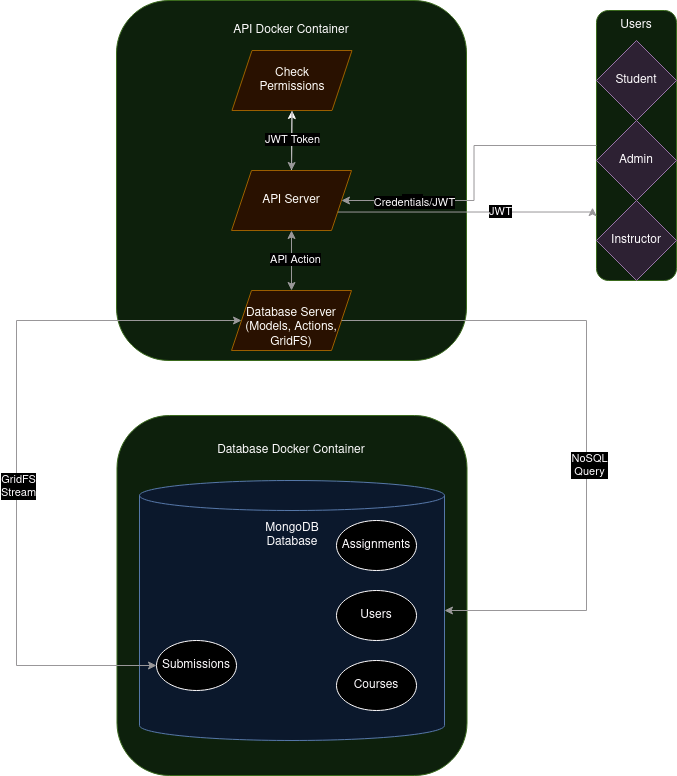
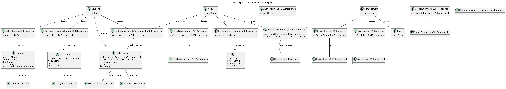

# Tarpaulin

Tarpaulin is a lightweight course management tool that serves as an "alternative" to Canvas. It allows instructors to create assignments for their courses and students to submit solutions to those assignments. 

## System Diagram


## UML Diagram


## Entities

### Users

Represents application users, each with one of three roles: admin, instructor, and student. Each role has different permissions for performing API actions, as detailed in the Tarpaulin OpenAPI specification.

### Courses

Represents courses being managed in Tarpaulin, including basic information (subject code, number, title, instructor) and lists of enrolled students and assignments.

### Assignments

Represents a single assignment for a course, with basic information such as title and due date, along with a list of student submissions.

### Submissions

Represents a single student submission for an assignment, tied to the submitting student and marked with a timestamp. Each submission is associated with an uploaded file.

## Actions

### Course Roster Download

- **Endpoint**: `GET /courses/{id}/roster`
- **Description**: Allows authorized users to download a CSV-formatted roster for a course. The CSV contains a list of enrolled students.
- **Example**:
    ```csv
    "abc123","Jane Doe","doej@oregonstate.edu"
    "def456","Luke Skywalker","skywallu@oregonstate.edu"
    ```
- **Implementation**: The roster is generated on-the-fly from the database

### Assignment Submission Creation

- **Endpoint**: `POST /assignments/{id}/submissions`
- **Description**: Allows authorized student users to upload a file submission for a specific assignment. The API should generate and return a URL for the uploaded file.
- **Implementation**: Store the file and generate a URL for later access, returned with submission details.

### User Data Fetching

- **Endpoint**: `GET /users/{id}`
- **Description**: Allows users to view their own data, including the list of classes they are enrolled in (students) or teaching (instructors).
- **Authorization**: Only the logged-in user can see their own data.

### Course Information Fetching

- **Endpoints**: `GET /courses`, `GET /courses/{id}`
- **Description**: Allows users to see information about all courses or a specific course, excluding details about enrolled students and assignments.
- **Details**: Fetch students with `GET /courses/{id}/students` and assignments with `GET /courses/{id}/assignments`.

## Pagination

The following endpoints support pagination:

- `GET /courses`
- `GET /assignments/{id}/submissions`

## Authorization

Many endpoints require authorization, implemented using a JWT-based authorization scheme.

## Docker Specification

The API application includes a complete Docker specification, allowing it to be launched from scratch on a new machine using Docker Compose. This includes:

- **Dockerfile**: Specifies dependencies for the main API server.
- **Docker Compose**: Specifies each service in the API (e.g., database) and their interactions.

The specification should enable launching the API from scratch, including necessary database initialization.

## Getting Started

1. **Clone the repository**:
    ```sh
    git clone <repository-url>
    cd <repository-directory>
    ```

2. **Build and run the application with Docker Compose**:
    ```sh
    docker-compose up --build
    ```

3. **Access the API**:
    - The API will be accessible at `http://localhost:<port>`.

## License

This project is licensed under the MIT License. See the [LICENSE](LICENSE) file for details.


